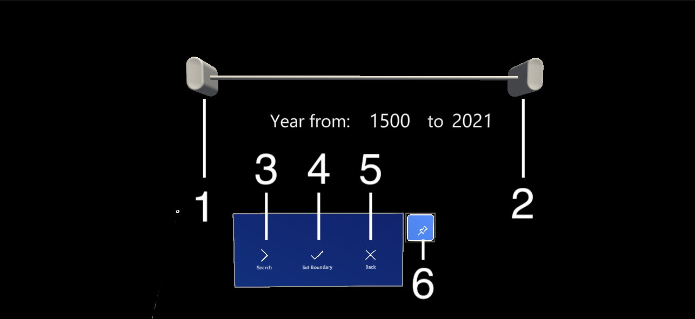
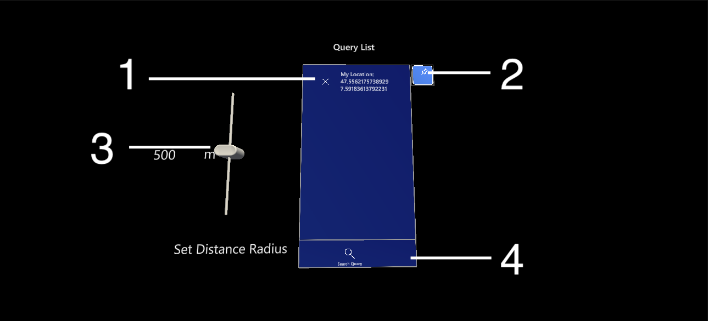
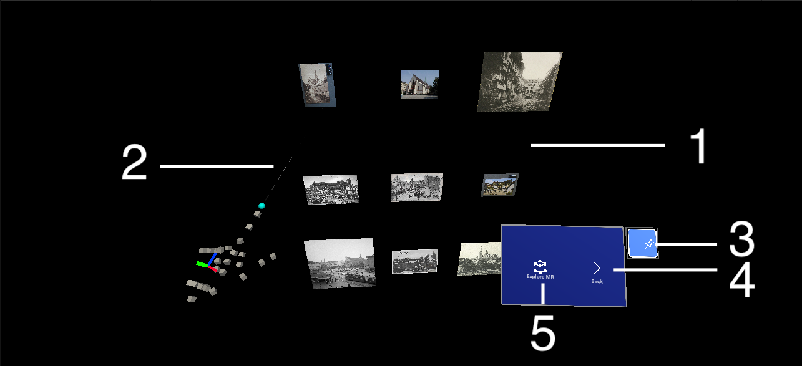
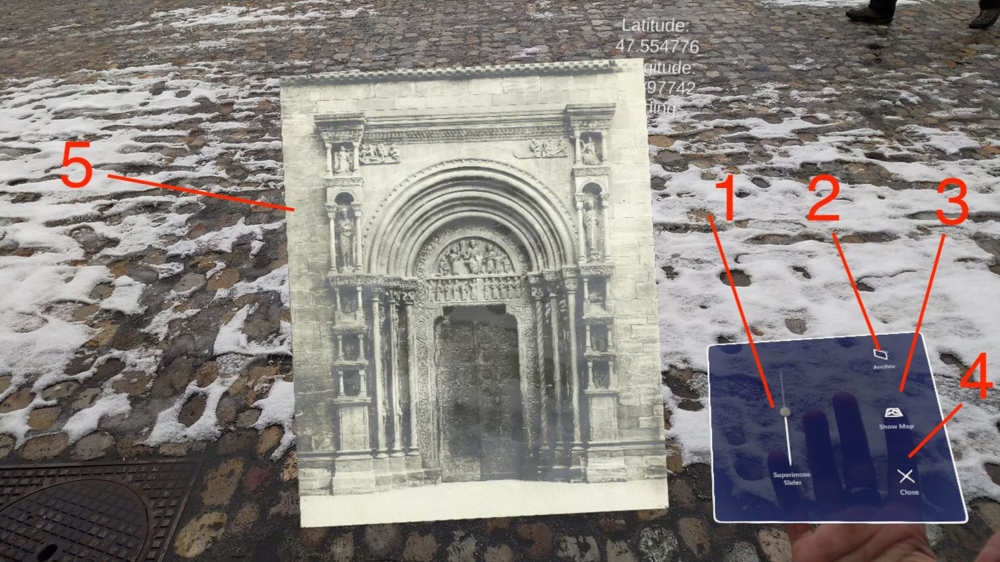
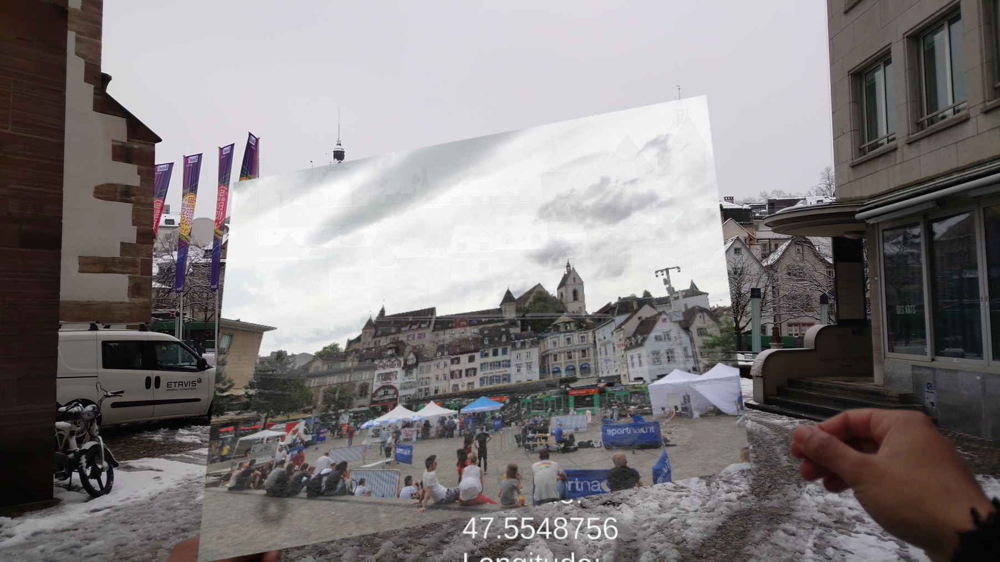
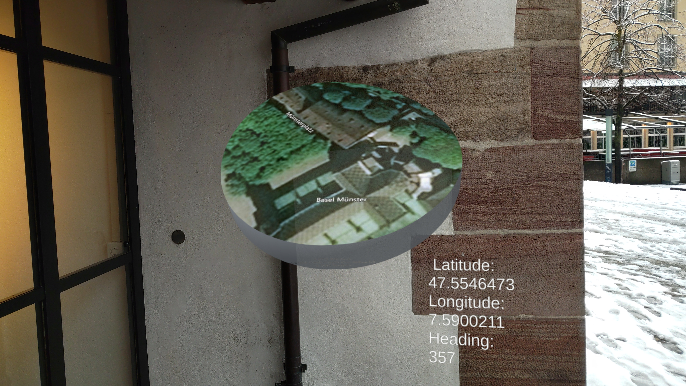
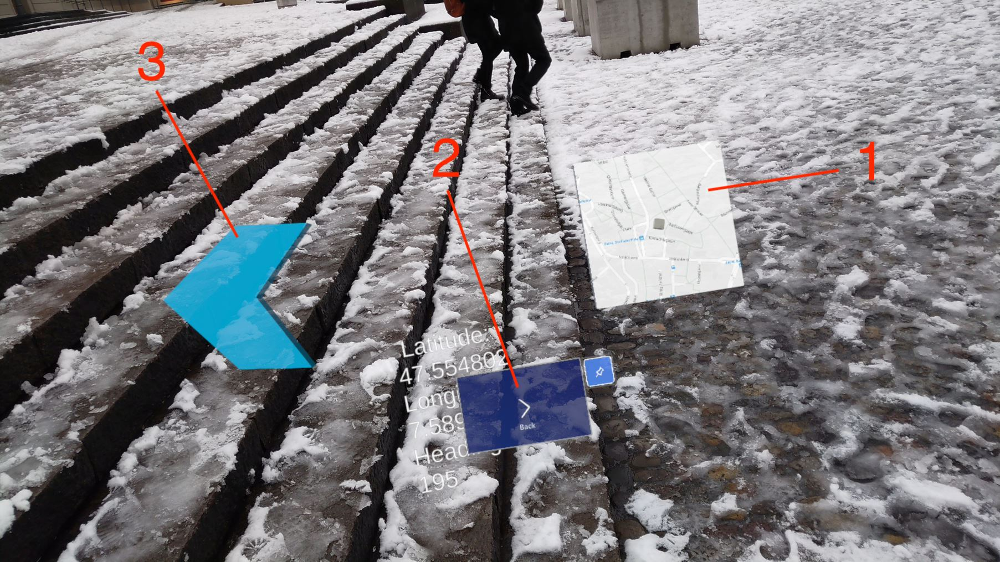
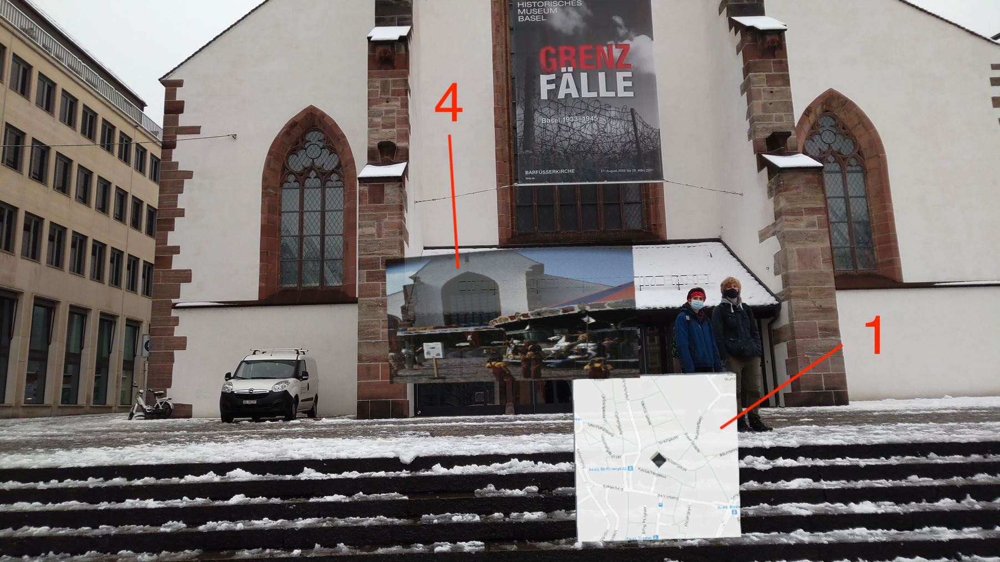
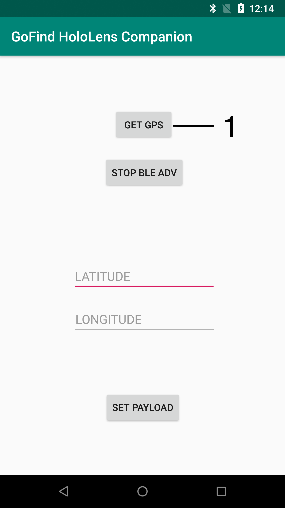

# Historic Image Presentation in MixedReality using HoloLens
GoFind Mixed Reality is an GoFind application build for the Hololens. It enables users to visualize historical pictures as holograms in the real world.


## GoFind!
The GoFind! [1] application is prototype enabling users to visualize historic multimedia collections at their real world location using Augmented Reality and Mulimedia Retrieval technologies. The application mainly targets smartphones running Android as it benefits from using Google's AR Core Framework which is used to build AR experiences. On the other hand it is extended by the Cineast UnityInterface API, a framework used to fetch results from vitrivr's retrieval engine Cineast.
To retrieve results, users can make use of the three core features of GoFind! i.e Query by Example (QbE), Query by Map location (QbM) and Query by Time (QbT). 
Users can choose one of the query or merge multiple queries together. The result is showcased in a scrollable list view which each result is ordered according to the distance between current location and result location. Alternatively with the help of the Location Awareness Service, users get notified when they reach the location of the result.
Thereupon the result can been superimposed to the current live feed of the camera portaying the virtual historical image as an overlay in the foreground while the background shows the real world. The alignment of the superimposed image with the real world is done manually as well as the adjustment of the opaqueness of the overlay. 
As said before, using the AR Core framework results are now spawned at its location with the correct bearing while maintaining the position of the object. User can freely move around and see the result anchored to the real world.


### GoFind MR! Architecture


## Prerequisites
* ``` Windows 10 - latest version``` 
* ``` HoloLens 2 Windows Holographic version 20H2``` 

## Technologies
* ``` Unity - version 2020 1.9``` 
* ``` Mixed reality toolkit - version 2.4 LTS``` 
* ``` UnitiyInterface API  - lateset version ``` 


## Deployment guide
1. Update to the latest Windows version using Windows updates
2. [Install the official Microsoft tools for MR development](https://docs.microsoft.com/en-us/windows/mixed-reality/develop/install-the-tools?tabs=unity)
3. In VSStudio Workloads dont forget to tick the following libraries:
   * Universal Windows Platform Development (UWP)
   * USB Connectivity
   * Desktop development with C++ 
6. [Install GIT for Windows](https://git-scm.com/download/win)
7. [Download Foundation and Example package of Mixed Reality Toolkit version 2.4 for Unity] (https://github.com/microsoft/MixedRealityToolkit-Unity/releases)
	* The project has been build using version 2.4. Using a different versions could lead to compilation errors
8. Install Unity Hub
7. In Unity Hub, install Unity version 2020 1.9 LTS with UWP plugin
8. [Clone the latest GoFind! MR from the cineast branch](https://phabricator.dmi.unibas.ch/source/gofind-mr/browse/master/)
8. Open ``` gofind-mr/Assets/Hololens/Scenes/QueryMenu.unity``` 
	* Ignore all compilation error, as there no libraries installed yet
9. Go to Assets -> Import Package -> Custom Package
	1. Select ``` Microsoft.MixedReality.Toolkit.Unity.Foundation.2.4.0.unitypackage``` 
	2. Select ``` Microsoft.MixedReality.Toolkit.Unity.Examples.2.4.0.unitypackage``` 
11. Create a file in ``` Assets/StreamingAssets/ called cineastapi.json``` 
	* If the folder ``` StreamingAssets```  does not exist, just create one
12. Paste this inside the JSON file and adjust accordingly (the server might not run anymore)

```json
{
  "cineastHost": "http://city-stories.dmi.unibas.ch:4567",
  "cineastServesMedia": true,
  "mediaHost": "http://10.34.58.145/",
  "categoryMappings": {
    "mapping": {
      "spatialdistance": "spatialdistance",
      "temporaldistance": "temporaldistance"
    }
  }
}
```

11. Open ```gofind-master/Packages/manifest.json```
12. Add the latest [Cineast Unity interace API](https://github.com/vitrivr/UnityInterface/tree/dev) from the dev branch by adding the following snippet to the ```Manifest.json```

```json
com.vitrivr.unityinterface.cineastapi": "https://github.com/vitrivr/UnityInterface.git#dev
```

13. Go to File -> Build settings and select Universal Windows Platform
14. Make sure ARM has been selected in the Architecture option.
10. Click Build
11. Connect the HoloLens to the PC
12. Make sure Development mode has been enabled on the PC and on the HoloLens. If not;
	
	* Turn on the HoloLens and put the device one
	* Launch the main menu
	* Go to the Settings
	* Select Update menu
	* Select the For developrs menu
	* Enable Developer Mode

13.	Make sure, it is also turned on the development pc
	* Go to Settings
	* Select Update and Security
	* Select For developers
	* Enable Developer Mode
	
		 
11. Open the generated ``` .SNL ``` file
12. In the Build settings in toolbar change the following:
	* Change ``` DEBUG```  to ``` MASTER``` 
	* Change ``` x64```  to ``` ARM``` 

16. Once the compilation is done, the application will launch automatically on the Hololens


## Development guide

10. As listed in step 9 of the deployment guide, once both packages have been added to our project, the Mixed Reality Toolkit (MRTK) will appear on top of the window bar.
11. In the Mixed Reality Toolkit toolbar, select: ```Add to Scene and Configure```. This will create a MR scene with the necessary objects.
12. In the Hierarchy, select the ```MixedRealityToolkit``` and set the ```Mixed Reality configuration``` file to ```DefaultHoloLens2ConfigurationsProfle``` in the Inspector.
13. As the MR scene is ready, we can start to develop using the MRTK SDK.

### Main menu

* In our implementation, we used the ```MainMenu``` unit as ```NearMenu```object from the MRTK. 
This prefab can be found in the ```/Assets/MRTK/Features/SDK/UX/Prefabs/Menus``` directory. The object contains a ```ButtonCollection```object. This collection contains buttons, which can be added or removed as GameObjects. Each button has a ```Interactable```component which helps listens to ```OnClick``` events.

This function registers button actions

```C#
{
   private GameObject Camera_button;
   private Interactable Camera_interactable;
   
   //Initiating GameObjects, before the Update()
   private void Awake()
   {   
            Camera_button = transform.GetChild(2).GetChild(0).gameObject;
            Camera_interactable = Camera_button.GetComponent<Interactable>();
            Camera_button_AddOnClick(Camera_interactable);
   }
         
   private void Camera_button_AddOnClick(Interactable cameraInteractable)
   {
   			  //Adding OnClickListener to the button
            cameraInteractable.OnClick.AddListener((() => OnCameraButtonLogic())); 
   }
   
   public void OnCameraButtonLogic()
    {
    		  //If the camera button has been pressed, the main menu receives the event
            var eventArgs = new CameraEventArgs();
            OnCameraSelect(this, eventArgs);     
    }
}
```

* The ```GetChild``` method finds the specified button in the ```ButtonCollection```. Further, the ```Interactable``` object is extracted using the ```GetComponent``` function, which allows to attach a```OnClickListener```, to listen user input.
* Additionaly, the ```NearMenu``` contains a ````Solver```` and a ```RadialView``` component. Both of them allows the ```NearMenu``` to follow the head gaze of the user.

```C#
{
   			  ShowPictureObject.GetComponent<SolverHandler>().enabled = true;
   			  ShowPictureObject.GetComponent<RadialView>().enabled = true;
  }
```

Again, using the```GetComponent```method, both components can be set active or inactive with their ```enabled``` flag.

We described in our thesis, that each submenus i.e QbE, QbM, QbCL and QbT are derived from the main menu. Hence each submenu contains the same functionalities we listed above.


### QbE
* The [PhotCapture API](https://docs.microsoft.com/en-us/windows/mixed-reality/develop/unity/locatable-camera-in-unity) has been added to enable camera access for 

```C#
{
   public void TakePhoto()
        {
            PhotoCapture.CreateAsync(false, OnPhotoCaptureCreated);
        }

   void OnPhotoCaptureCreated(PhotoCapture captureObject)
        {
            photoCaptureObject = captureObject;
            Resolution cameraResolution = PhotoCapture.SupportedResolutions.OrderByDescending((res) => res.width * res.height).First();
            CameraParameters c = new CameraParameters();
            c.hologramOpacity = 0.0f;
            c.cameraResolutionWidth = cameraResolution.width;
            c.cameraResolutionHeight = cameraResolution.height;
            c.pixelFormat = CapturePixelFormat.BGRA32;
            captureObject.StartPhotoModeAsync(c, OnPhotoModeStarted);
        }

    private void OnPhotoModeStarted(PhotoCapture.PhotoCaptureResult result)
        {
            if (result.success)
            {
                string filename = string.Format(@"CapturedImage{0}_n.jpg", Time.time);
                string filePath = System.IO.Path.Combine(Application.persistentDataPath, filename);
                photoCaptureObject.TakePhotoAsync(OnCapturedPhotoToMemory);
            }
            else
            {
                Debug.LogError("Unable to start photo mode!");
            }
        }
        
    void OnCapturedPhotoToMemory(PhotoCapture.PhotoCaptureResult result, PhotoCaptureFrame photoCaptureFrame)
        {
            if (result.success)
            {
                // Create our Texture2D for use and set the correct resolution
                Resolution cameraResolution = PhotoCapture.SupportedResolutions.OrderByDescending((res) => res.width * res.height).First();
                Texture2D targetTexture = new Texture2D(cameraResolution.width, cameraResolution.height);
                
                // Copy the raw image data into our target texture
                photoCaptureFrame.UploadImageDataToTexture(targetTexture);
      
                var eventArgs = new TakePhotoEventArgs();
                eventArgs.base64 = ToBase64DataUrl(targetTexture);
                OnTakePhoto(this, eventArgs);
            }
  }
```

Once the picture has been taken, the ```OnCapturedPhotoToMemory```function will save the image as a ```Texture2D```
object, which is processed further.

### QbM

* For QbM, we added 3D bing map using [Maps SDK](https://docs.microsoft.com/en-us/windows/mixed-reality/develop/install-the-tools?tabs=unity). Roughly explained, the Maps SDK contains a component called ```MapRenderer``` which can be applied to a GameObject.

* Additionally, double air tap is implemented besides the pinch and hold interaction.
This method implementend in the ```MapView``` class which is component of the map object. Hence, our implemtation will run alongs side of the map interaction handlers.

```C#
{
   public void DoubleAirTap()
        {
            var ray = camera.ScreenPointToRay(Input.mousePosition);

            if (Input.GetMouseButtonDown(0))
            {
                temps = Time.time ;
                click = true ;
                longClickDone = false ;
            }
            
            if (Input.GetMouseButtonUp(0))
            {
                click = false ;
                if((Time.time - temps) < 0.2) // Time to complete a double tap
                {
                    if(renderer.Raycast(ray, out MapRendererRaycastHit hitInfo))
                    {
                        var hitpoint = hitInfo.Point;
                        
                        Debug.Log(renderer.TransformWorldPointToLatLon(hitpoint)); 
							
							//Registering the lat and lon of the hit point on the map
                        LatLonAlt latLonAlt = new LatLonAlt(renderer.TransformWorldPointToLatLon(hitpoint).LatitudeInDegrees,renderer.TransformWorldPointToLatLon(hitpoint).LongitudeInDegrees,0);

                        GenerateLatLonObject(latLonAlt);
                    }
                }
            }   }
```

By exploiting the ```Input.GetMouseButtonDown``` event, we were able register air tap events as well.


* Apart from the map, a zoom slider is added alongside the map menu using the ```Pinch slider``` prefab from MRTK. This slider is found in the```Assets/MRTK/SDK/Features/UX/Scripts/Sliders``` directory. The ```Pinch slider``` utilizes a component with the same name to calculate each tick distance.

* In the map menu, the ```Show Basel``` button causes to zoom into Basel. The component which has been used here is called ```ZoomToMapPin``` component which can be found in ```Assets/Microsoft.Maps.Unity.Examples/MapPin/Scripts```. This component automatically zooms in/out to a given coordinate.


### QbCL
* The query menu is made up of a scrollable list. This list uses the  ```VerticalScroll Buttons2``` prefab which is a part of MRTK and is found in the``` Assets/HoloLens/Prefab``` directory.  This list contains a ```ButtonsCollection```, where buttons can be added or removed. GPS coordinates are added in form of these buttons. By pressing ```Add current position to query```, will set the list to active.

```C#
   public void createSelection(POICoordinatesObject poiCoordinatesObject)
    {
    		 //loading button prefab
        	 GameObject POIButton = (GameObject)Resources.Load("Prefab/POIButton",typeof(GameObject)); 
        	 
       	 POIButton = Instantiate(POIButton);
       	 POIButton.transform.rotation = transform.rotation;
       	 POIButton.GetComponent<ButtonConfigHelper>().MainLabelText = poiCoordinatesObject.ToString();
       	 POIButton.GetComponent<ButtonAttribute>().setID_coordinates(ButtonID,poiCoordinatesObject);
       	 POIButton.GetComponent<Interactable>().OnClick.AddListener((() => OnQueryRemoveButtonLogic(POIButton,poiCoordinatesObject)));
      	 	 POIButton.gameObject.transform.parent = transform.GetChild(2).GetChild(0);
       	 queryList[ButtonID] = POIButton;
      		 ButtonID++;
      		 
      		 //Updating the scollobjecollection
       	 scrollingObjectCollection.UpdateCollection();
    }
```
After every button insertion, the ```scrollObjectCollection``` must be updated.

### QbT
* Again the ```Pinch slider``` prefab is used to visualize slider objects to create lower and upper boundery sliders. These sliders are added alongside the temporal menu


### Image presentation methods
Different result presetnations have been added alongside the result menu
#### Scroll list view
* The ```VerticallScrollObjects``` prefab has been used to present images in a grid like structure. It also contains a object collection, which helps to add GameObject to the list. In our case, images are added in form of GameObjects. The ```VerticallScrollObjects``` prefab can be found in the ```Assets/HoloLens/Prefabs/``` directory


#### Hand Menu
* The ```HandMenu_Slider``` prefab is used for the Hand menu image settings. It can be found in the ```Assets/MRTK/Examples/Demos/HandTracking/Prefabs/``` directory. This object contains a slider and two buttons. Same as the other menu components, it consist of a ````ButtonCollection```` object and ```PinchSlider``` component. This object is set to active once a picture has been choosen.
* To use this object, a hand surface must be shown.

#### MR mode
* Images are spawned using the ```GetHeading``` function

```C#
 public void GetHeading(GameObject ShowPicture, float picture_bearing)
    {
    		//Calculating the angle
      		float angle_dif = currentheading - picture_bearing;
      		ShowPicture.transform.RotateAround(Camera.main.transform.position, new Vector3(0,1f,0), angle_dif); 
     }

```

```Transform.RotateAround``` function rotates the ```Image``` at a given angle, while the ```camera.main``` object remains in the center.

* The arrow object, which points to the direction of the spawned object, is a component from the MRTK. This object contains the ```DirectionalIndicator``` component, where an active GameObject can be targeted to point at. In our case, it points to the spawned image. This component is found in the```Assets/MRTK/Examples/Experimental/Solvers/DirectionalIndicatorExample.unity``` scene.

#### Receiving BLEAdvertisement
* GPS data is parsed from a receiving BLE advertisment. To receive the advertisement itself, UWP functions have been used.

```C#
{    
    
#if WINDOWS_UWP
  //Loading Bluetooth Low Energy Advertisment Driver
    BluetoothLEAdvertisementWatcher watcher; 
#endif
    private void Awake()
    {
        		BLT_Text =  GetComponent<TextMeshPro>(); 
        currentCoordinates = new List<Coordinates>();

#if WINDOWS_UWP
				//Initialising BLE Driver
        		watcher = new BluetoothLEAdvertisementWatcher(); 
        		// Matching ID with ANDROID Device
        		var manufacturerData = new BluetoothLEManufacturerData{CompanyId = ANDROID_ID};  
        		
        		// Filtering Manuf. Data with ID
        		watcher.AdvertisementFilter.Advertisement.ManufacturerData.Add(manufacturerData); 
        		
        		watcher.ScanningMode = BluetoothLEScanningMode.Active; // Function required for HOLOLENS2 
        		watcher.Received += Watcher_Received; 
		       watcher.Start();
        		Debug.Log("Started watching");
#endif
    }

    private double lat;
    private double lon;
    private float hea;
#if WINDOWS_UWP
    /*
     * Reading Data and translating to required values.
     */
    private async void Watcher_Received(BluetoothLEAdvertisementWatcher sender, BluetoothLEAdvertisementReceivedEventArgs args)
    {
        		byte[] data = args.Advertisement.ManufacturerData[0].Data.ToArray();
        
				   //Dispatch the 'OnReceived' event
               lat = BitConverter.ToDouble(data, 0);
               lon = BitConverter.ToDouble(data,8);
               hea = BitConverter.ToSingle(data,16);

               if(!currentCoordinates.Contains(new Coordinates(lat,lon,hea))){
                		if(currentCoordinates.Count != 0){
                           coo_id++;
                        }
               if(currentCoordinates.Count == 60){
                    currentCoordinates.Clear();
                            coo_id = 0;
                }
         		 currentCoordinates.Add(new Coordinates(lat,lon,hea));
    }
    
#endif
}
```
The ```BluetoothLEAdvertismentWatcher``` listens to incoming advertisments. Once the advertisment has been received, the data is extracted using the ```BitConverter``` object which converts segments of data, based on its type.


## User manual

### Query menu


1. Pin the menu
2. ``` Image``` Query by Example resp. by map (QbM)
2. ``` Spatial``` Query by location resp. by map (QbM)
3. ``` Add current location to query``` Query by location resp. by location (QbCl)
4. ``` Temporal``` Query by time (QbT)
5. ``` Reset``` Fetched results are flushed


### Query by example (QbE)


1.  ``` Take Picture``` will take a picture of the scene for QbE
2. ``` Back```  will returns to the query menu
3. Pin this menu

### Query by Map (QbM)


1. Bing map
2. POI, using double air tap
3. Moving the map around using the pointer
4. ``` Show Basel```  will zoom the map to the city of Basel
5. Zoom slider
6. Pins this menu
7. ``` Back```Resturns to the query menu


### Query by Temporal (QbT)




1. This slider sets the lower bound of the temporal setting
2. This slider sets the upper bound of the temporal setting
3. ``` Search```  will show the results
4. ``` Set boundary```  will show the results
5. ``` Back```Resturns to the query menu
6. Pins this menu

### Query list



1. Location coordinates are listed, pressing this button will delete the listed coordinates
2. Pins this menu
3. Distance slider can be set for limiting distance radius
4. 3. ``` Search```  will show the results


### Result presentation
Result presentation shows the query result.




1. Results are represented as scroll list
2. Pointer is used to select the image and to scroll
3. Pins this menu
4. ``` Back```Resturns to the query menu
4. ``` Explore MR mode```  starts the MR mode

##### Hand menu
Hand menu allows user to change various image parameters. The image itself can be grabbed and stretched or moved around.


    

1. To increase the transparency, use the Superimpose slider
2. ``` Anchor```  sets the image to fixed a position in the real world
3. ``` Show on Map``` shows the map
4.  ``` Close``` will close the image and return to the result scroll list

##### Map view
In Map view, the true location of the image is shown




##### MR mode
In MR mode, historical  images are  spawned in real time and overlayed when they walktrough the city. A helper arrow will show the direction where the image has been spawned


    

1. The side map shows the current position of the user
2. ``` Back```  returns to the result presentation
3. Arrow
4. The spawned image

## GoFind! MR Companion App
The external location provider has been build as a standalone Android application, which helps to transmit latitude, longitude and heading data from the device sensor readings.  The transmission takes places by using Bluetooth low energy (BLE) technology.

### Prerequisites
* Android device with GPS support and Bluetooth specification 4.2 and above

### Setup

1. Install the latest Android Studio
2. Open the studio and import the gradle file located at 
 ```
 /gofind-mr/Companion/build.gradle
 ```
3. Connect the android device to the PC and make sure android debugging is enable on the android device
	* [Click here to see, how to enable it] (https://developer.android.com/studio/debug/dev-options)
4. Click on the play button to install and run the Companion app on the device

### Features



1. Starts retrieving GPS data and transmiting via BLE


## Status
Project is: _finished_

## Inspiration
[1]: L. Sauter, L. Rossetto and H. Schuldt Exploring Cultural Heritage in Augmented Reality with GoFind! 2018 IEEE International Conference on Artificial Intelligence and Virtual Reality (AIVR) Taichung, Taiwan, 2018, pp. 187-188. https://doi.org/10.1109/AIVR.2018.00041
